# Synthetic Statistics
This research project explores the application of generative modeling techniques to power analyses and statistical testing.

## Synthetic Power Analyses
> In a scientific study, one typically aims for a statistical power of 80%, implying that a true effect in the population is
> detected with a 80% chance. Power computations allow researchers to compute the minimal number of subjects to obtain the
> aimed statistical power. As such, power calculations avoid spending time and money on studies that are futile, and also
> prevent wasting time and money adding extra subjects, when sufficient power was already available.

> Mounting evidence over the last few years suggest that published neuroscience research suffer from low power, and especially
> for published fMRI experiments. Not only does low power decrease the chance of detecting a true effect, it also reduces the
> chance that a statistically significant result indicates a true effect ([Ioannidis, 2005](http://journals.plos.org/plosmedicine/article?id=10.1371/journal.pmed.0020124)). Put another way, findings with the
> least power will be the least reproducible, and thus a (prospective) power analysis is a critical component of any paper.

Source: [Power and sample size calculations for fMRI studies based on the prevalence of active peaks](https://www.biorxiv.org/content/biorxiv/early/2016/04/20/049429.full.pdf)

> Our current scan rate is $563 per hour.

Source: [University of Michigan Functional Magnetic Resonance Imaging Laboratory](http://fmri.research.umich.edu/users/billing.php)

### Proposal
Synthetic functional magnetic resonance images generated with [state-of-the-art generative modeling techniques](https://github.com/BlissChapman/ICW-fMRI-GAN) could serve as a low-cost replacement for pilot data used in power analyses.

**WANTED:** the smallest sample size needed for a study with 80% power

**NOT WANTED:**
1) Wasted time/money on futile experiments
2) Wasted resources on extra subjects
3) Underpowered studies

### Experiments
We explore the potential of synthetic power analyses through univariate, multivariate, and neuroimaging experiments. In the figures below, if the synthetic and real power curves are the same shape, then using synthetic data in our power analyses will yield a similar sample size estimate as we would have achieved with real data.

If we can train a generative model to synthesize realistic new data, doesn't that mean our training set contains more than enough data for a simple power analysis? Our fMRI generative modeling techniques can synthesize cognitive process label combinations that do not exist in the original dataset. Thus we can formulate power analyses with data that has never been collected before.

###### [NULL] Gaussian(0, 1) vs Gaussian(0, 1) w/ 100k True Samples
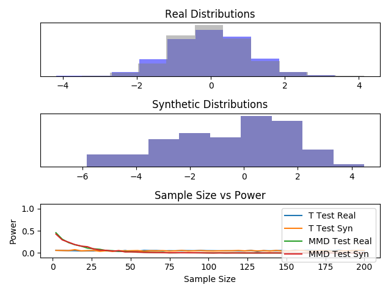

###### [NULL] Gaussian(0, 1) vs Gaussian(0, 1) w/ 100 True Samples
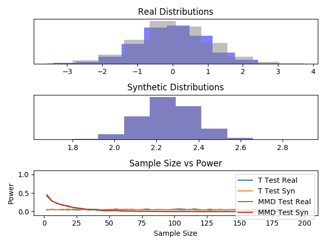

###### [ALTERNATIVE] Gaussian(0, 1) vs Gaussian(1, 1) w/ 100k True Samples
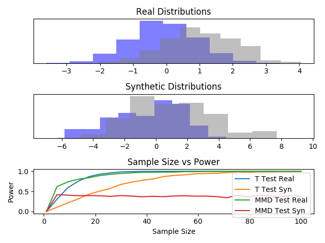

###### [ALTERNATIVE] Gaussian(0, 1) vs Gaussian(1, 1) w/ 100 True Samples
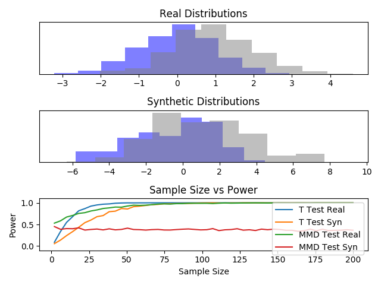

###### [NULL] ChiSquare(9) vs ChiSquare(9) w/ 100k True Samples
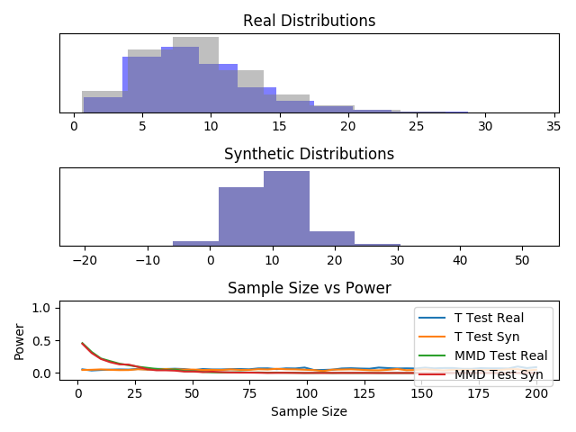

###### [NULL] ChiSquare(9) vs ChiSquare(9) w/ 100 True Samples
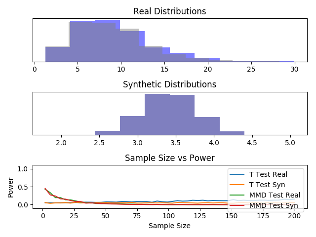

###### [ALTERNATIVE] ChiSquare(9) vs Exp(9) w/ 100k True Samples
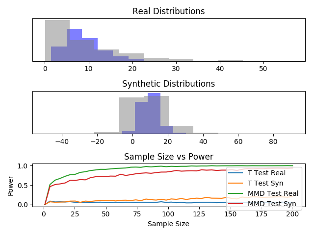

###### [ALTERNATIVE] ChiSquare(9) vs Exp(9) w/ 100 True Samples
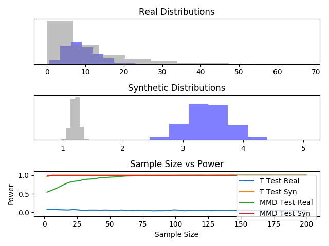

###### [ALTERNATIVE] GaussianMix vs Exp(9) w/ 100k True Samples
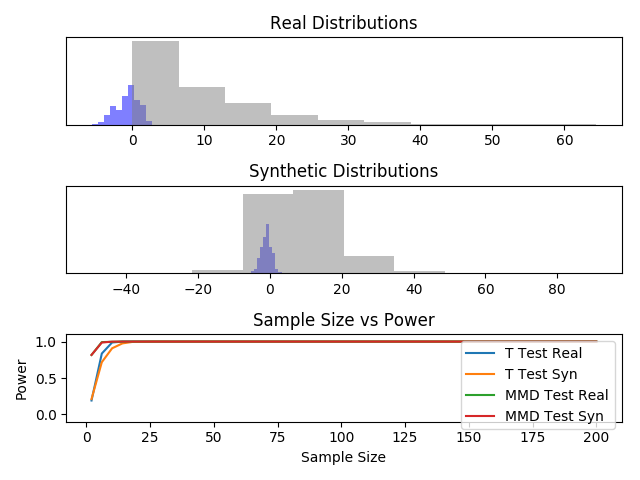

###### [ALTERNATIVE] GaussianMix vs Exp(9) w/ 100 True Samples
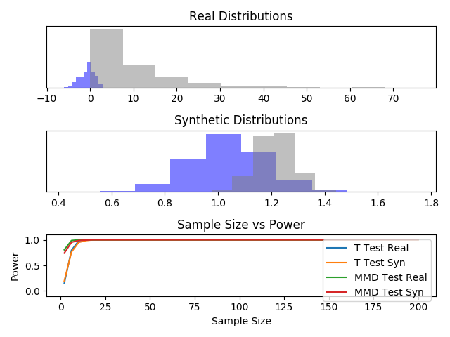

###### [NULL] Visual vs Visual w/in Brainpedia
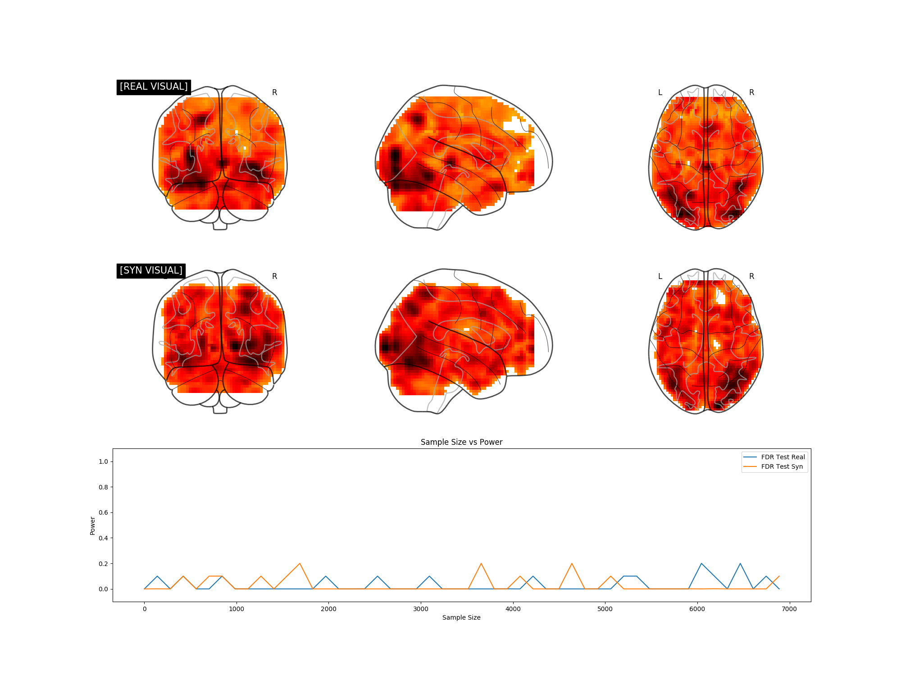

###### [ALTERNATIVE] Visual vs Non-Visual w/in Brainpedia
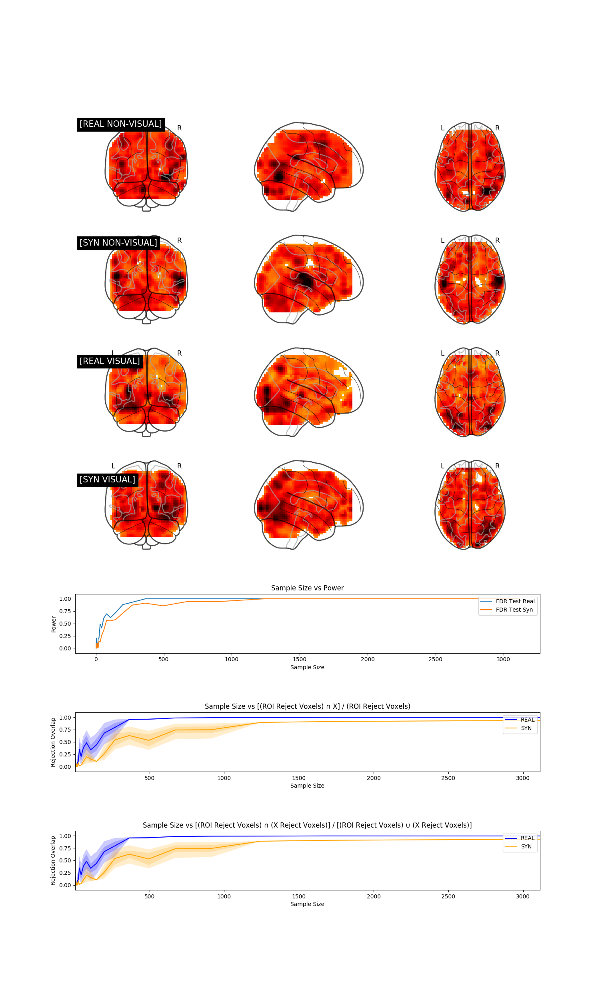

### Notes on Power Calculation
##### Univariate Power
1) Use bootstrap techniques to compute the distribution of the t test statistic.
2) Compute p value for every test statistic.
3) Power is approximately mean[1(p_i < alpha)]

_Note: If the distribution is known to be Gaussian, we can directly compute the t test statistic without bootstrap techniques._

##### Multivariate Power
_[Discussion to come]_

##### fMRI Power
_[Discussion to come]_

## Synthetic Statistical Testing
Test whether two distributions P and Q are different based on samples drawn from each of them.

### Parametric Approach
1) Sample from distribution P.
2) Sample from distribution Q.
3) Run a classical two sample t-test.

But why assume the data is Gaussian?

### Non-Parametric Approach
1) Sample from distribution P.
2) Sample from distribution Q.
3) Run a non-parametric test like a [Kernel Two-Sample Test](http://www.gatsby.ucl.ac.uk/~gretton/mmd/mmd.htm).

### Proposed Approach
1) Given samples from P, use a generative model to recover an estimate P^ of the underlying probability distribution of P.
2) Given samples from Q, use a generative model to recover an estimate Q^ of the underlying probability distribution of Q.
3) Using unlimited synthetic data from the learned distributions P^ and Q^, run a (parametric or non-parametric) test to distinguish between the two.

The goal of this project is to show that sampling synthetic data from the underlying data distribution can enable powerful tests with fewer assumptions about the underlying data distribution.

## Results
### Number of True Samples vs Power
###### [NULL] Gaussian(0, 1) vs Gaussian(0, 1)
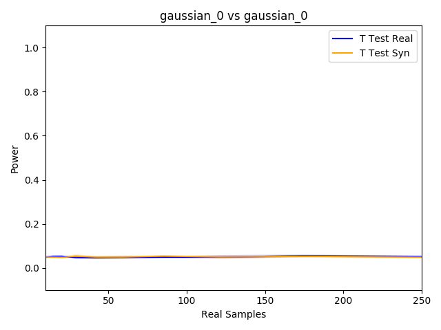

###### [NULL] Gaussian(0.1, 1) vs Gaussian(0.1, 1)
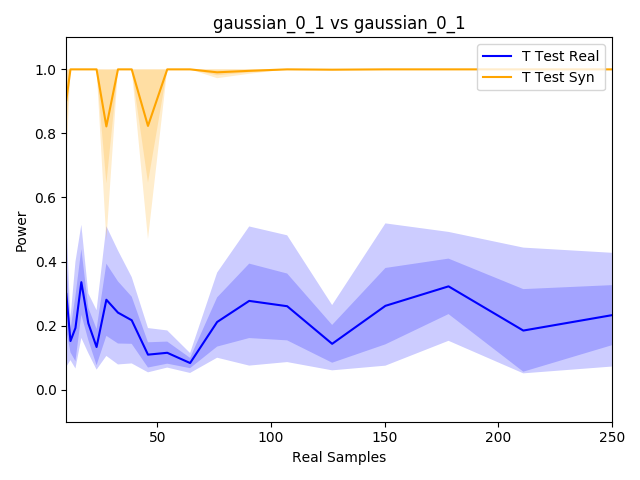

###### [ALTERNATIVE] Gaussian(0, 1) vs Gaussian(0.1, 1)
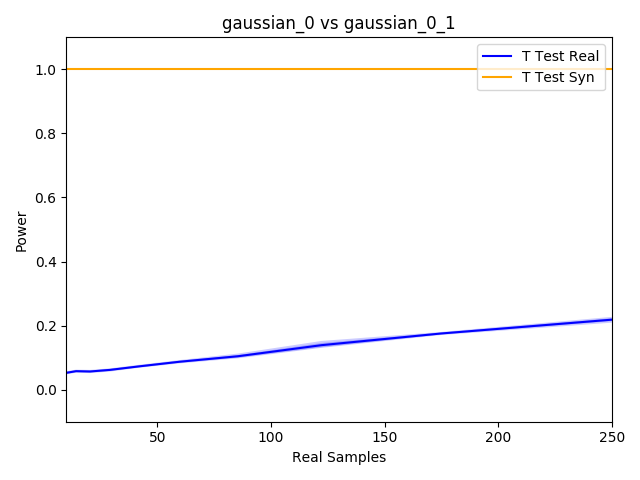

###### [ALTERNATIVE] Gaussian(0, 1) vs GaussianMix
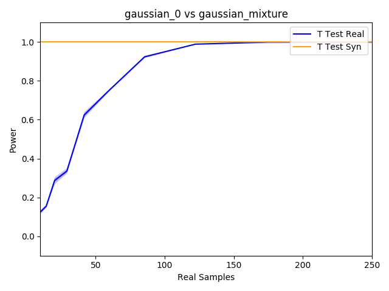

###### [ALTERNATIVE] Gaussian(0, 1) vs ChiSquare(9)
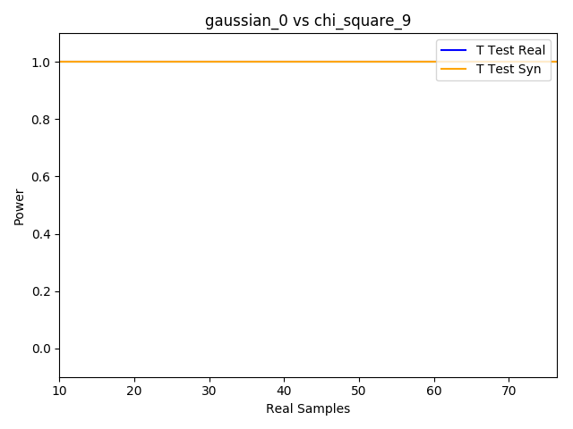

###### [ALTERNATIVE] Gaussian(0, 1) vs Exp(9)
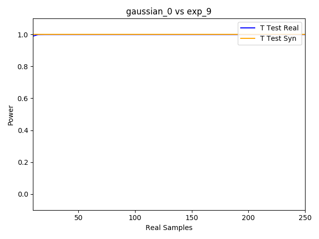

###### [NULL] ChiSquare(9) vs ChiSquare(9)
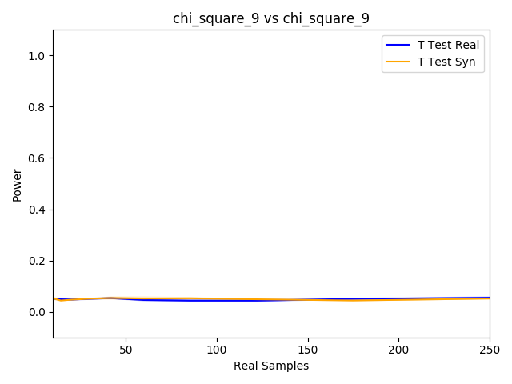

###### [ALTERNATIVE] ChiSquare(9) vs Exp(9)
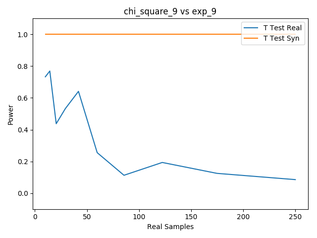

###### [ALTERNATIVE] ChiSquare(9) vs GaussianMix
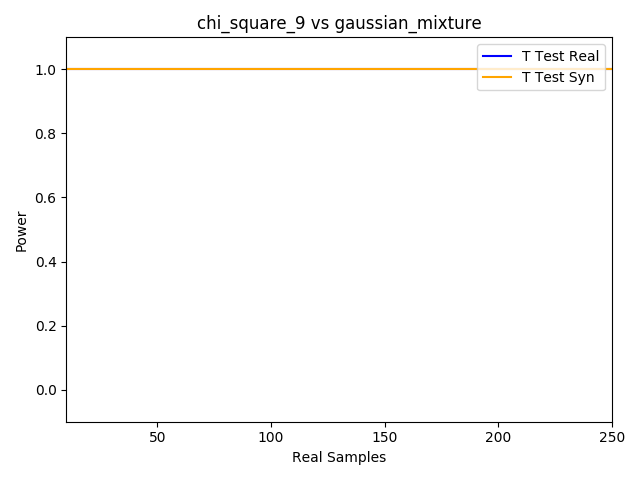

###### [NULL] Exp(9) vs Exp(9)
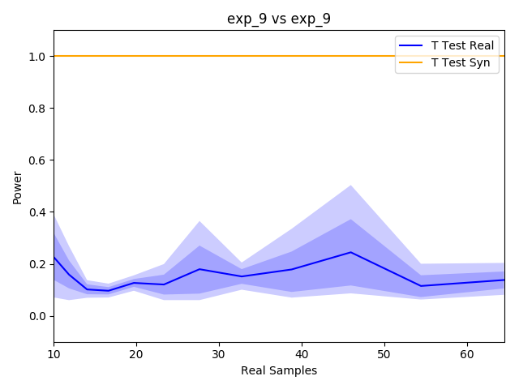

###### [ALTERNATIVE] Exp(9) vs GaussianMix
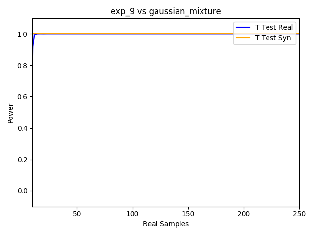

###### [NULL] GaussianMix vs GaussianMix

###### [NULL] Visual vs Visual
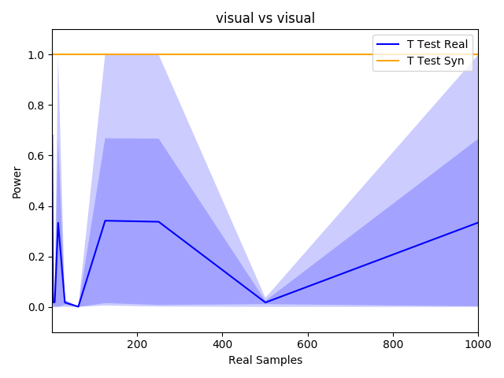

###### [NULL] NON-Visual vs NON-Visual
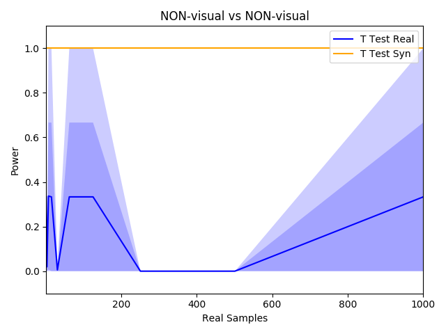

###### [ALTERNATIVE] Visual vs NON-Visual

