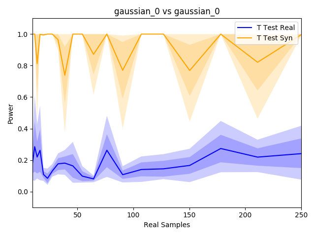
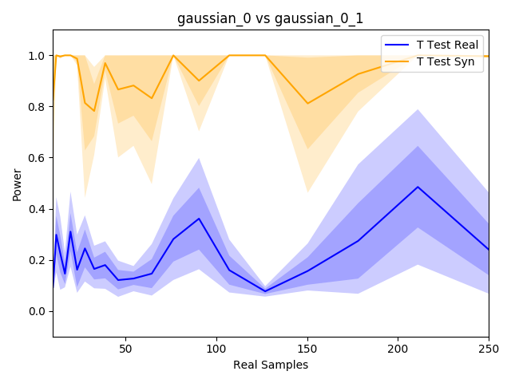
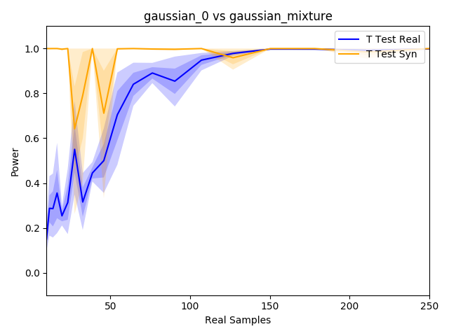
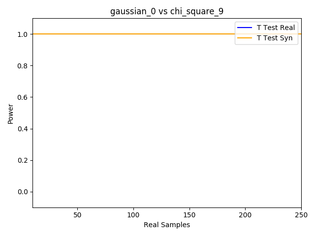
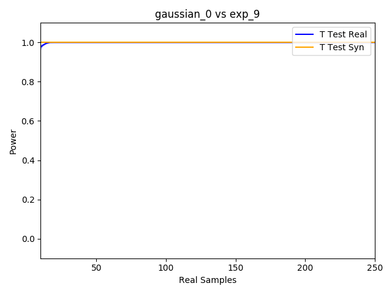
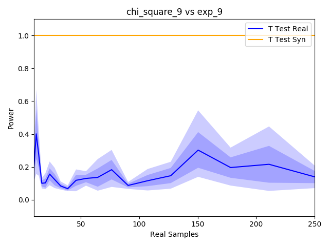
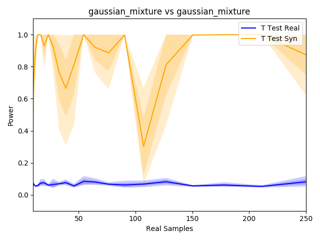
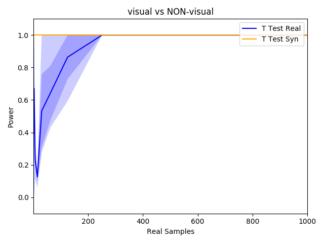
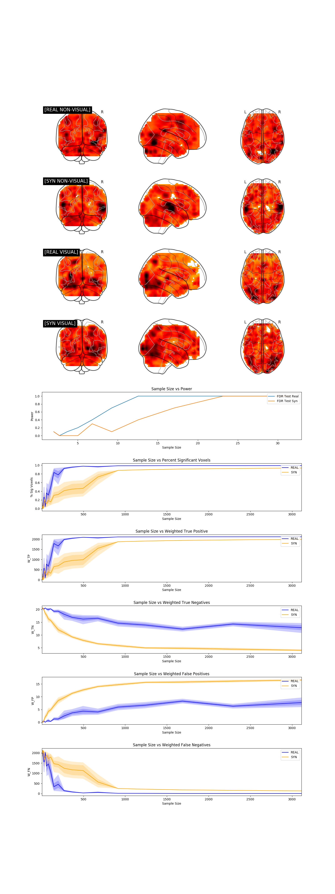

# Synthetic Statistics
This project explores the application of generative modeling techniques to statistical testing.

### Objective
Test whether two distributions P and Q are different based on samples drawn from each of them.

### Parametric Approach
1) Sample from distribution P.
2) Sample from distribution Q.
3) Run a classical two sample t-test.

But why assume the data is Gaussian?

### Non-Parametric Approach
1) Sample from distribution P.
2) Sample from distribution Q.
3) Run a non-parametric test like a [Kernel Two-Sample Test](http://www.gatsby.ucl.ac.uk/~gretton/mmd/mmd.htm).

### Proposed Approach
1) Given samples from P, use a generative model to recover an estimate P^ of the underlying probability distribution of P.
2) Given samples from Q, use a generative model to recover an estimate Q^ of the underlying probability distribution of Q.
3) Using unlimited synthetic data from the learned distributions P^ and Q^, run a (parametric or non-parametric) test to distinguish between the two.

The goal of this project is to show that sampling synthetic data from the underlying data distribution can enable powerful tests with fewer assumptions about the underlying data distribution.

## Results
### Number of True Samples vs Power
###### [NULL] Gaussian(0, 1) vs Gaussian(0, 1)

###### [NULL] Gaussian(0.1, 1) vs Gaussian(0.1, 1)

###### [ALTERNATIVE] Gaussian(0, 1) vs Gaussian(0.1, 1)

###### [NULL] [ZOOMED] Gaussian(0, 1) vs Gaussian(0, 1)

###### [NULL] [ZOOMED] Gaussian(0.1, 1) vs Gaussian(0.1, 1)

###### [ALTERNATIVE] [ZOOMED] Gaussian(0, 1) vs Gaussian(0.1, 1)

###### [ALTERNATIVE] Gaussian(0, 1) vs GaussianMix

###### [ALTERNATIVE] Gaussian(0, 1) vs ChiSquare(9)

###### [ALTERNATIVE] Gaussian(0, 1) vs Exp(9)

###### [NULL] ChiSquare(9) vs ChiSquare(9)

###### [ALTERNATIVE] ChiSquare(9) vs Exp(9)

###### [ALTERNATIVE] ChiSquare(9) vs GaussianMix

###### [NULL] Exp(9) vs Exp(9)

###### [ALTERNATIVE] Exp(9) vs GaussianMix

###### [NULL] GaussianMix vs GaussianMix

###### [NULL] Visual vs Visual

###### [NULL] NON-Visual vs NON-Visual

###### [ALTERNATIVE] Visual vs NON-Visual

### Number of Test Time Samples vs Power
#### Gaussians
###### [NULL] Gaussian(0, 1) vs Gaussian(0, 1) w/ 100k True Samples

###### [NULL] Gaussian(0, 1) vs Gaussian(0, 1) w/ 100 True Samples

###### [ALTERNATIVE] Gaussian(0, 1) vs Gaussian(1, 1) w/ 100k True Samples

###### [ALTERNATIVE] Gaussian(0, 1) vs Gaussian(1, 1) w/ 100 True Samples

#### Non-Gaussian
###### [NULL] ChiSquare(9) vs ChiSquare(9) w/ 100k True Samples

###### [NULL] ChiSquare(9) vs ChiSquare(9) w/ 100 True Samples

###### [ALTERNATIVE] ChiSquare(9) vs Exp(9) w/ 100k True Samples

###### [ALTERNATIVE] ChiSquare(9) vs Exp(9) w/ 100 True Samples

###### [ALTERNATIVE] GaussianMix vs Exp(9) w/ 100k True Samples

###### [ALTERNATIVE] GaussianMix vs Exp(9) w/ 100 True Samples

#### Neuroscientific Application
> Mounting evidence over the last few years suggest that published neuroscience research suffer from low power, and especially
> for published fMRI experiments. Not only does low power decrease the chance of detecting a true effect, it also reduces the
> chance that a statistically significant result indicates a true effect ([Ioannidis, 2005](http://journals.plos.org/plosmedicine/article?id=10.1371/journal.pmed.0020124)). Put another way, findings with the
> least power will be the least reproducible, and thus a (prospective) power analysis is a critical component of any paper.
<!--
> In a scientific study, one typically aims for a statistical power of 80%, implying that a true effect in the population is
> detected with a 80% chance. Power computations allow researchers to compute the minimal number of subjects to obtain the
> aimed statistical power. As such, power calculations avoid spending time and money on studies that are futile, and also
> prevent wasting time and money adding extra subjects, when sufficient power was already available. -->

Source: [Power and sample size calculations for fMRI studies based on the prevalence of active peaks](https://www.biorxiv.org/content/biorxiv/early/2016/04/20/049429.full.pdf)

###### [NULL] Visual vs Visual w/in Brainpedia

###### [ALTERNATIVE] Visual vs Non-Visual w/in Brainpedia

